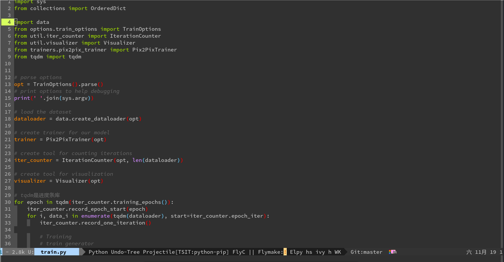

# Emacs Configuration

This is my personal Emacs configuration. This is a simple configuration for Emacs newbies like me.

## Installation

Launch a terminal and run:

```bash
git clone https://github.com/coder109/.emacs.d ~/.emacs.d
```

Have fun:)

## Screenshot



